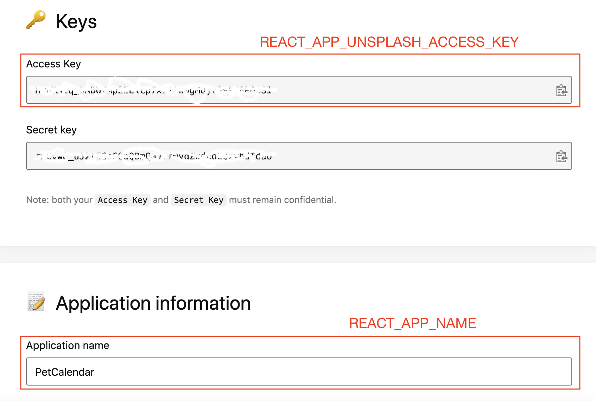

# PetCalendar

A calendar application that refreshes you with cute pet images.

## NZMSA/2020-Phase-1/Web-App

This project is finished as the assignment for [Microsoft Student Accelerator New Zealand 2020 Phase 1 - Web App](https://github.com/NZMSA/2020-Phase-1/tree/master/Web%20App).

In response to the Assignment requirements:

- [x] Create a new typescript and react web app
- [x] Connect this application to a different 3rd party REST API
      This application is connected to [Unsplash Image API](https://unsplash.com/developers) to fetch HD pet images for the user.
- [x] Allow users to input information that will be utilised by the API
      User will be able to choose from six pets, which the API uses to search for pet images.
- [x] Make use of a UI library like Material-UI.
      A range of Material-UI components are used to improve the visual expression and responsiveness of the Application.
- [x] Utilise source control through GitHub.

## Screen Shot


## Run the APP

### Step 1: Unsplash API credential

To run the app on your local machine, you will first need to have an Unsplash API credential.
Go to the [Unsplash Image API](https://unsplash.com/developers) page and create a new Application.
Save the `Access Key` and the `Application Name`:



### Step 2: Create .env.development file

Create `pet-calendar/.env.development` file. Follow the format of (`pet-calendar/.env.development`)[https://github.com/niuniuanran/PetCalendar/blob/develop/pet-calendar/env.example] and paste the strings from Step 1 into it.

### Step 3: Run the Application

Run the following steps to start the application:

```
$ cd pet-calendar
$ npm install
$ npm run start
```

Now enjoy your pet calendar at http://localhost:3000/.
